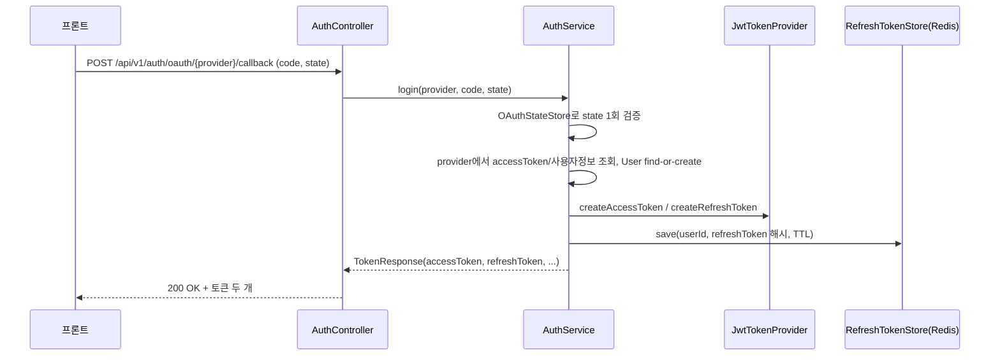
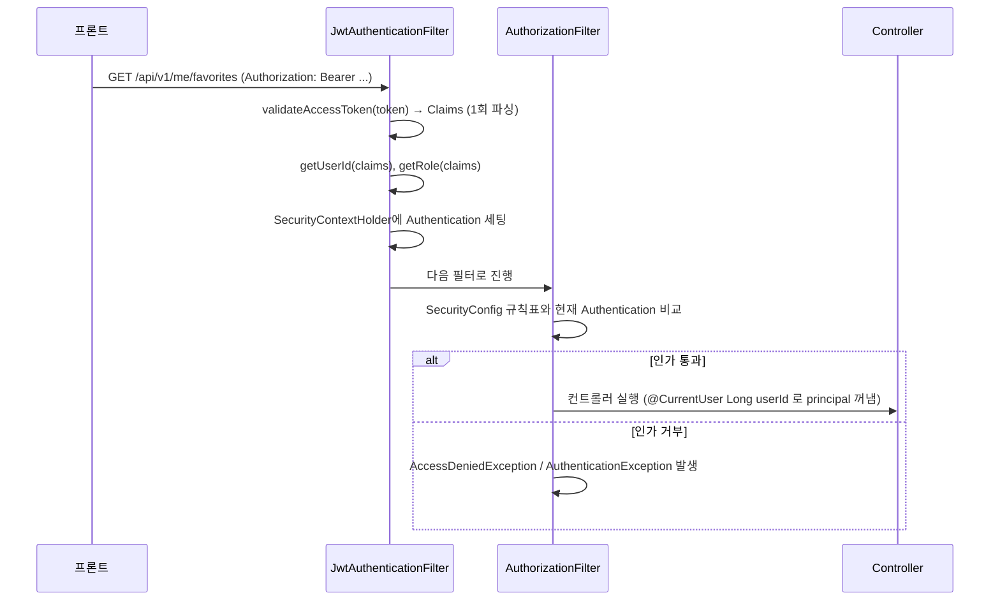
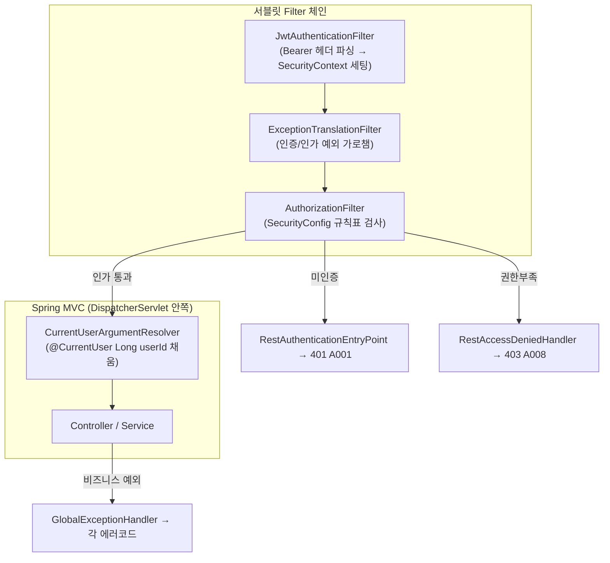

# Spring 요청 처리 & Spring Security 필터 & JWT 인증/인가 학습 노트

이 문서는 Spring MVC가 요청을 처리하는 방식(Filter/Interceptor)과 Spring Security의 필터 체인이 그 안에 어떻게 끼어드는지, 그리고 이 저장소(`feat/20-social-login`)에 실제로 적용된 JWT 인증/인가 구현을 연결해서 이해하기 위한 노트다. 코드 참조는 실제 파일 기준이며, 구현이 바뀌면 이 문서도 같이 갱신한다.

## 1. 서블릿 컨테이너 관점에서 본 요청 처리 순서

Spring Boot(내장 Tomcat) 기준으로 HTTP 요청 하나가 컨트롤러 메서드까지 도달하는 경로는 이렇다.

```text
Client
  │
  ▼
[Servlet Filter 체인]  ← web.xml/FilterRegistrationBean으로 등록된 모든 Filter (순서 있음)
  │   Spring Security는 여기에 "FilterChainProxy"라는 단 하나의 Filter로 끼어든다
  ▼
DispatcherServlet (Spring MVC의 진입점, 그 자체도 사실 하나의 Servlet)
  │
  ├─ HandlerMapping: 어떤 컨트롤러 메서드가 이 요청을 처리할지 결정
  │
  ▼
[HandlerInterceptor 체인]  ← preHandle
  │
  ▼
HandlerAdapter → Controller 메서드 실행
  │   (파라미터 바인딩 시점에 HandlerMethodArgumentResolver가 개입 — 예: @CurrentUser)
  ▼
[HandlerInterceptor 체인]  ← postHandle → afterCompletion
  │
  ▼
Response
```

핵심은 **Filter는 DispatcherServlet 바깥(서블릿 표준), Interceptor는 DispatcherServlet 안쪽(Spring MVC 전용)** 이라는 것이다.

## 2. Filter vs Interceptor vs ArgumentResolver

| | Filter | HandlerInterceptor | HandlerMethodArgumentResolver |
|---|---|---|---|
| 표준 | Jakarta Servlet 표준(`jakarta.servlet.Filter`) | Spring MVC 전용 | Spring MVC 전용 |
| 위치 | DispatcherServlet **이전/이후** | HandlerMapping이 컨트롤러를 특정한 **이후**, 컨트롤러 호출 **직전/직후** | 컨트롤러 메서드 **파라미터 바인딩 시점** |
| 아는 것 | `HttpServletRequest`/`Response`만 | 실행될 `HandlerMethod`(어떤 컨트롤러/메서드인지)까지 | 해당 파라미터의 타입·애노테이션 |
| 요청 자체를 바꿀 수 있는가 | O (Request/Response 래핑 가능) | 제한적 (진행 여부만 결정) | 해당 파라미터 값만 생성 |
| 이 프로젝트에서의 예 | `JwtAuthenticationFilter`, Spring Security의 각종 내부 필터 | 현재 사용 안 함(과거 `LoginRequiredInterceptor` 시도가 있었지만 경로 기반 방식으로 되돌림) | `CurrentUserArgumentResolver`(`@CurrentUser`) |

Spring Security는 **Filter**로 동작한다. 즉 "인증됐는지"는 컨트롤러가 실행되기 한참 전, DispatcherServlet에 도달하기도 전에 이미 결정된다. 그래서 인증/인가 실패는 `@RestControllerAdvice`([`GlobalExceptionHandler`](../src/main/java/com/bop/youthpick/global/error/GlobalExceptionHandler.java))로 잡히지 않고, Security 전용 처리기가 따로 필요하다(3장 참고).

## 3. Spring Security = 하나의 커다란 Filter (`FilterChainProxy`)

Spring Security를 켜면 서블릿 Filter 체인에 `FilterChainProxy`라는 필터가 딱 하나 등록된다. 이 안에서 우리가 [`SecurityConfig`](../src/main/java/com/bop/youthpick/global/config/SecurityConfig.java)에 정의한 `SecurityFilterChain`(보안 전용 필터들의 체인)이 실행된다. 이 프로젝트(STATELESS + JWT, CSRF 비활성) 기준으로 관련 있는 필터만 순서대로 나열하면:

```text
FilterChainProxy
 └─ SecurityFilterChain
     ├─ SecurityContextHolderFilter   ← 요청마다 SecurityContext를 준비하고, 끝나면 정리
     ├─ CorsFilter                    ← corsConfigurationSource() 적용
     ├─ (LogoutFilter — 우리는 컨트롤러에서 직접 로그아웃 처리해서 크게 안 씀)
     ├─ JwtAuthenticationFilter        ← 우리가 addFilterBefore로 직접 끼워넣은 커스텀 필터
     ├─ UsernamePasswordAuthenticationFilter (폼 로그인용, 사용 안 하지만 기본 존재)
     ├─ ExceptionTranslationFilter     ← AuthenticationException/AccessDeniedException을 여기서 가로챔
     └─ AuthorizationFilter            ← authorizeHttpRequests(...) 규칙을 실제로 검사(구버전 이름: FilterSecurityInterceptor)
```

`SecurityConfig`의 코드와 1:1로 대응된다.

```java
http.csrf(csrf -> csrf.disable())
        .cors(cors -> cors.configurationSource(corsConfigurationSource()))
        .sessionManagement(session -> session.sessionCreationPolicy(SessionCreationPolicy.STATELESS))
        .exceptionHandling(exception -> exception
                .authenticationEntryPoint(restAuthenticationEntryPoint)   // ExceptionTranslationFilter가 씀
                .accessDeniedHandler(restAccessDeniedHandler));           // ExceptionTranslationFilter가 씀

http.authorizeHttpRequests(auth -> auth
        .requestMatchers("/api/v1/admin/**").hasRole("ADMIN")
        .requestMatchers(...).permitAll()
        .requestMatchers(...).authenticated()
        .anyRequest().permitAll());          // AuthorizationFilter가 이 규칙표로 매 요청을 검사

http.addFilterBefore(new JwtAuthenticationFilter(jwtTokenProvider),
        UsernamePasswordAuthenticationFilter.class);   // 우리 필터를 체인의 특정 위치에 삽입
```

`addFilterBefore(필터, 기준필터.class)`는 "이 필터를 기준필터보다 앞에 넣어라"는 뜻이다. `JwtAuthenticationFilter`가 `UsernamePasswordAuthenticationFilter`보다 먼저 실행돼야, 우리가 Bearer 토큰으로 인증을 채운 뒤에 이후 필터들(특히 `AuthorizationFilter`)이 그 인증 정보를 보고 판단할 수 있다.

## 4. `authorizeHttpRequests`의 매칭 규칙 — 순서가 중요하다

`requestMatchers(...)`는 **위에서부터 먼저 매칭되는 규칙이 이긴다.** 그래서 [`SecurityConfig`](../src/main/java/com/bop/youthpick/global/config/SecurityConfig.java)는 좁은 규칙(관리자 전용, 회원 전용)을 먼저 쓰고 마지막에 `anyRequest().permitAll()`로 나머지를 다 열어둔다.

```java
.requestMatchers("/api/v1/admin/**").hasRole("ADMIN")                 // 1. 관리자만
.requestMatchers("/api/v1/auth/oauth/**", ... ).permitAll()           // 2. 비회원 공개
.requestMatchers("/api/v1/auth/me", "/api/v1/me/**", ...).authenticated()  // 3. 로그인 필요
.anyRequest().permitAll()                                              // 4. 나머지(다른 도메인 미구현분)는 개발 편의상 전부 허용
```

- `hasRole("ADMIN")`은 내부적으로 `ROLE_ADMIN`이라는 `GrantedAuthority`를 요구한다(Spring Security가 자동으로 `ROLE_` 접두어를 붙여서 비교함).
- `authenticated()`는 "누구든 로그인만 했으면 됨"이고, `permitAll()`은 "인증 여부 안 봄"이다.
- 새 엔드포인트를 인증 필수로 만들 때는 이 규칙표에 경로를 추가해야 한다. 여기 안 넣으면 마지막 `anyRequest().permitAll()`에 걸려 누구나 접근 가능해진다(`docs`의 보안 체크리스트에도 이 항목이 있다).

## 5. JWT 인증 흐름 — 로그인부터 매 요청까지

### 5-1. 로그인(OAuth 콜백) 시 토큰 발급



`RefreshTokenStore`([RefreshTokenStore.java](../src/main/java/com/bop/youthpick/auth/service/RefreshTokenStore.java))는 refresh token **원문을 저장하지 않고 SHA-256 해시만** 저장한다. Redis가 유출되더라도 그 값으로 바로 로그인할 수 없게 하기 위함이다.

### 5-2. 이후 모든 요청 — `Authorization: Bearer <accessToken>`



[`JwtAuthenticationFilter`](../src/main/java/com/bop/youthpick/auth/service/JwtAuthenticationFilter.java)는 `OncePerRequestFilter`를 상속한다. 서블릿 스펙상 요청이 내부적으로 forward/include 되면 필터가 여러 번 실행될 수 있는데, `OncePerRequestFilter`는 그걸 막아 **요청당 정확히 한 번만** 실행되게 해준다.

이 필터가 하는 일은 딱 세 가지다.

1. `Authorization` 헤더에서 `Bearer ` 토큰을 꺼낸다(`resolveToken`).
2. [`JwtTokenProvider.validateAccessToken(token)`](../src/main/java/com/bop/youthpick/auth/service/JwtTokenProvider.java)로 서명·만료·토큰 타입(`access`)을 검증하고 `Claims`를 돌려받는다. **검증된 `Claims`를 그대로 재사용**해서 `getUserId(claims)`/`getRole(claims)`를 호출한다 — 예전에는 `validateAccessToken`/`getUserId`/`getRole`이 각각 내부에서 토큰을 다시 파싱해서 요청 하나당 서명검증을 3번 하던 걸 리팩터링으로 1번으로 줄였다.
3. 검증에 성공하면 `AuthPrincipal(userId, role)`을 principal로 담은 `Authentication`을 만들어 `SecurityContextHolder`에 넣는다. **role이 null이면 `"ROLE_null"`이라는 이상한 권한을 만들지 않고 그냥 인증 정보를 채우지 않는다.**

토큰이 없거나 검증에 실패해도 이 필터는 요청을 막지 않고 그냥 다음 필터로 넘긴다(`filterChain.doFilter` 항상 호출). **실제 차단은 이 필터가 아니라 뒤쪽의 `AuthorizationFilter`가 한다** — 그래야 공개 경로(`permitAll()`)는 토큰이 없어도 정상 처리되고, 보호된 경로만 인증 요구가 걸린다.

## 6. 인증 실패 vs 인가 실패 — 응답이 갈리는 지점

| 상황 | 예 | 필터 체인에서 발생하는 예외 | 처리기 | 응답 |
|---|---|---|---|---|
| 토큰이 없음/유효하지 않음(로그인 안 된 상태로 보호된 경로 접근) | `GET /api/v1/auth/me`에 토큰 없이 접근 | `AuthenticationException` | [`RestAuthenticationEntryPoint`](../src/main/java/com/bop/youthpick/global/config/RestAuthenticationEntryPoint.java) | 401 `A001` |
| 로그인은 됐지만 권한(role)이 부족 | 일반 회원이 `/api/v1/admin/**` 접근 | `AccessDeniedException` | [`RestAccessDeniedHandler`](../src/main/java/com/bop/youthpick/global/config/RestAccessDeniedHandler.java) | 403 `A008` |
| 컨트롤러 진입 후 비즈니스 로직에서 던진 예외 | `AuthException(AuthErrorCode.INVALID_REFRESH_TOKEN)` 등 | (필터 단계 아님, 일반 예외) | [`GlobalExceptionHandler`](../src/main/java/com/bop/youthpick/global/error/GlobalExceptionHandler.java)의 `handleCustomException` | 각 에러코드의 status |

앞의 두 경우는 **`ExceptionTranslationFilter`가 필터 체인 안에서 잡는다.** 이 시점엔 아직 `DispatcherServlet`도, 그 안의 `@RestControllerAdvice`도 실행되지 않았기 때문에 `GlobalExceptionHandler`가 절대 못 잡는다. 그래서 `RestAuthenticationEntryPoint`/`RestAccessDeniedHandler`가 각각 필터 레벨에서 직접 `HttpServletResponse`에 JSON을 써서 응답한다 — 다만 **응답 JSON 포맷(`ErrorResponse.of(errorCode)`)은 `GlobalExceptionHandler`가 만드는 것과 동일한 모양으로 통일**해서, 클라이언트 입장에서는 어디서 막혔는지 상관없이 항상 같은 에러 응답 구조를 받는다.

세 번째 경우(컨트롤러/서비스 계층에서 던진 예외)는 이미 `DispatcherServlet`을 통과해 컨트롤러까지 도달한 뒤라 일반적인 Spring MVC 예외 처리(`@RestControllerAdvice`)로 잡힌다.

## 7. `@CurrentUser` — Filter/Interceptor와는 다른 지점

[`CurrentUserArgumentResolver`](../src/main/java/com/bop/youthpick/auth/service/CurrentUserArgumentResolver.java)는 `HandlerMethodArgumentResolver`다. 이건 필터도 인터셉터도 아니고, **컨트롤러 메서드를 호출하기 직전, 파라미터 값을 채우는 단계**에서 동작한다(1장 다이어그램의 "HandlerAdapter → Controller 메서드 실행" 부분).

```java
@GetMapping("/me")
public ApiResponse<AuthUserResponse> me(@CurrentUser Long userId) { ... }
```

이 리졸버는 DB나 토큰을 다시 보지 않는다. `JwtAuthenticationFilter`가 이미 채워둔 `SecurityContextHolder`의 `AuthPrincipal.userId()`를 그대로 꺼내줄 뿐이다(값이 없으면 `AuthException(UNAUTHORIZED)`). 그래서 인증 여부 판단은 필터 단계에서 이미 끝나 있고, 이 리졸버는 "이미 인증된 요청에서 누가 로그인했는지"만 편하게 꺼내 쓰는 도구다.

등록은 [`WebMvcConfig`](../src/main/java/com/bop/youthpick/global/config/WebMvcConfig.java)의 `addArgumentResolvers`로 한다(`WebMvcConfigurer`는 `HandlerInterceptor` 등록도 같은 곳에서 하지만, 지금은 인터셉터를 쓰지 않는다).

## 8. Refresh Token 재발급이 "검증"까지 하는 이유

`POST /api/v1/auth/token/refresh`는 JWT 자체 검증(서명/만료/타입)만으로 끝나지 않는다. [`AuthService.refresh()`](../src/main/java/com/bop/youthpick/auth/service/AuthService.java)를 보면:

```java
Claims claims = jwtTokenProvider.validateRefreshToken(refreshToken);   // ① JWT 자체 검증
Long userId = jwtTokenProvider.getUserId(claims);
...
boolean rotated = refreshTokenStore.rotate(userId, refreshToken, newRefreshToken, ttl); // ② Redis 대조 + 교체
if (!rotated) throw new AuthException(AuthErrorCode.INVALID_REFRESH_TOKEN);
```

JWT는 서명이 유효하고 만료 전이면 그 자체로는 "위조되지 않았다"만 증명할 뿐, "아직 살아있는(로그아웃되지 않은, 이미 한 번 쓰이지 않은) 토큰인가"는 증명하지 못한다. 그래서 [`RefreshTokenStore.rotate(...)`](../src/main/java/com/bop/youthpick/auth/service/RefreshTokenStore.java)가 Redis에 저장된 해시와 제출된 토큰의 해시를 **Lua 스크립트로 원자적으로 대조 후 교체**한다.

- 일치하면 새 refresh token 해시로 교체(재사용 방지를 위한 rotate) → 성공.
- 불일치(이미 로그아웃됨/이미 재발급에 쓰여서 폐기됨)면 거부.
- "대조"와 "교체"를 하나의 Lua 스크립트로 묶은 이유는 동시에 같은 refresh token으로 두 번 재발급 요청이 와도 **하나만 성공**하게 만들기 위해서다(따로 하면 둘 다 대조를 통과한 뒤 각자 교체해버리는 race condition이 생긴다).

## 9. 전체 그림 한 장



## 10. 관련 코드 인덱스

| 개념 | 파일 |
|---|---|
| 보안 필터 체인/인가 규칙 정의 | [`SecurityConfig`](../src/main/java/com/bop/youthpick/global/config/SecurityConfig.java) |
| JWT Bearer 헤더 해석 필터 | [`JwtAuthenticationFilter`](../src/main/java/com/bop/youthpick/auth/service/JwtAuthenticationFilter.java) |
| JWT 발급/검증 | [`JwtTokenProvider`](../src/main/java/com/bop/youthpick/auth/service/JwtTokenProvider.java) |
| Redis 기반 refresh token 저장/원자적 rotate | [`RefreshTokenStore`](../src/main/java/com/bop/youthpick/auth/service/RefreshTokenStore.java) |
| 인증 principal DTO | [`AuthPrincipal`](../src/main/java/com/bop/youthpick/auth/dto/AuthPrincipal.java) |
| 인증 실패(401) 처리 | [`RestAuthenticationEntryPoint`](../src/main/java/com/bop/youthpick/global/config/RestAuthenticationEntryPoint.java) |
| 인가 실패(403) 처리 | [`RestAccessDeniedHandler`](../src/main/java/com/bop/youthpick/global/config/RestAccessDeniedHandler.java) |
| `@CurrentUser` 파라미터 리졸버 | [`CurrentUser`](../src/main/java/com/bop/youthpick/auth/service/CurrentUser.java) / [`CurrentUserArgumentResolver`](../src/main/java/com/bop/youthpick/auth/service/CurrentUserArgumentResolver.java) |
| ArgumentResolver 등록 | [`WebMvcConfig`](../src/main/java/com/bop/youthpick/global/config/WebMvcConfig.java) |
| 비즈니스 예외 → 에러 응답 변환 | [`GlobalExceptionHandler`](../src/main/java/com/bop/youthpick/global/error/GlobalExceptionHandler.java) |
| OAuth 로그인/토큰 발급/재발급/로그아웃 흐름 | [`AuthService`](../src/main/java/com/bop/youthpick/auth/service/AuthService.java) |

## 11. 자주 헷갈리는 부분 Q&A

**Q. Interceptor 대신 Filter를 쓴 이유는?**
인증 여부 판단은 Spring MVC의 handler 매핑보다 먼저, 그리고 Security의 표준 필터 체인(`ExceptionTranslationFilter`, `AuthorizationFilter` 등)과 나란히 동작해야 하기 때문이다. Interceptor는 Spring MVC 내부 개념이라 Security의 필터 체인과 결합하기 어렵다. (실제로 이 프로젝트에서 `LoginRequiredInterceptor`로 인가를 처리해보려던 시도가 있었지만, `SecurityConfig`의 경로 기반 규칙으로 되돌렸다 — 인가 판단의 단일 소스를 `SecurityConfig`로 유지하기 위함.)

**Q. `@CurrentUser`가 왜 DB를 안 보고도 동작하나?**
JWT의 `sub`(subject) 클레임에 이미 userId가 들어있고, `JwtAuthenticationFilter`가 이걸 미리 `SecurityContextHolder`에 넣어두기 때문이다. `@CurrentUser`는 그 값을 꺼내기만 한다. `User` 엔티티 전체가 필요하면(예: `AuthController.me()`) 컨트롤러에서 `authService.getCurrentUser(userId)`를 별도로 호출해 DB를 조회한다.

**Q. `anyRequest().permitAll()`이 마지막에 있는데 안전한가?**
지금은 다른 도메인(정책/즐겨찾기 등) 컨트롤러가 아직 없어서 개발 편의상 열어둔 상태다. 새 컨트롤러를 추가할 때마다 `SecurityConfig`의 규칙표에 그 경로를 명시적으로 추가해야 하며, 빠뜨리면 그 경로는 인증 없이 접근 가능해진다(보안 리뷰 체크리스트 항목).
